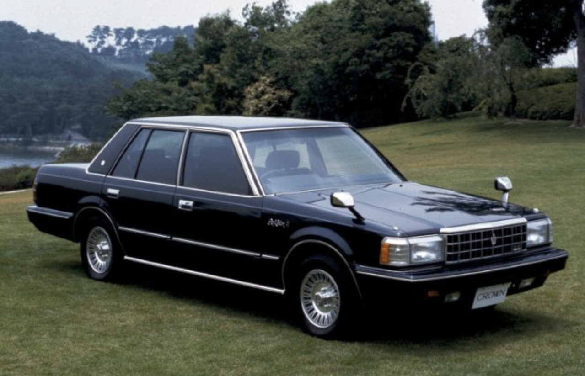
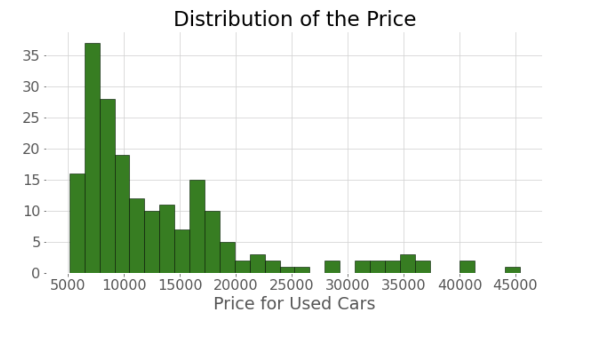
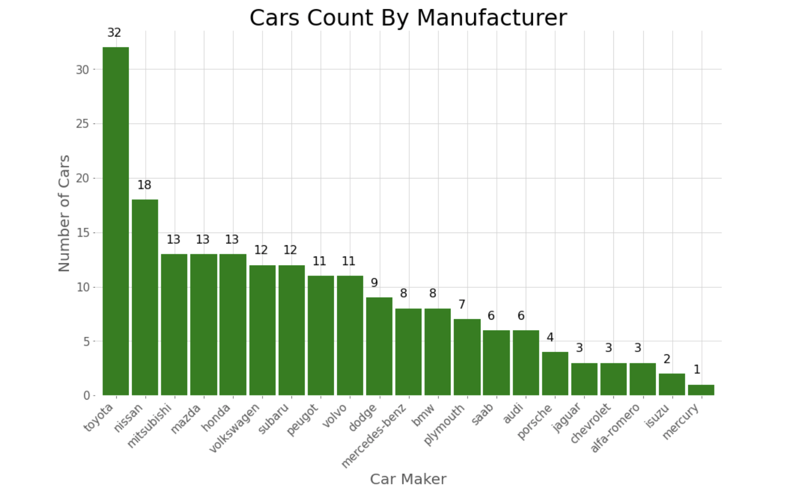
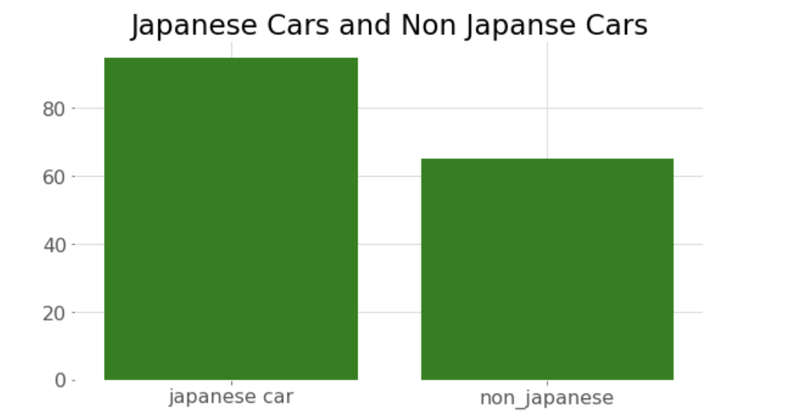
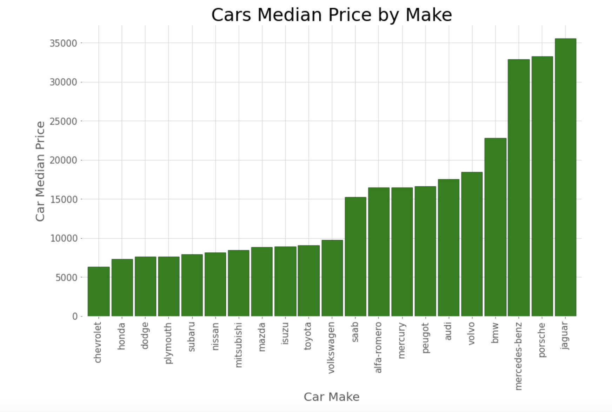
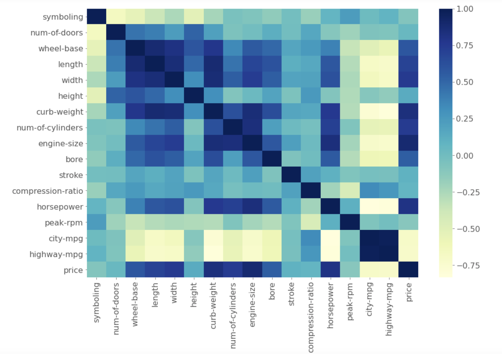
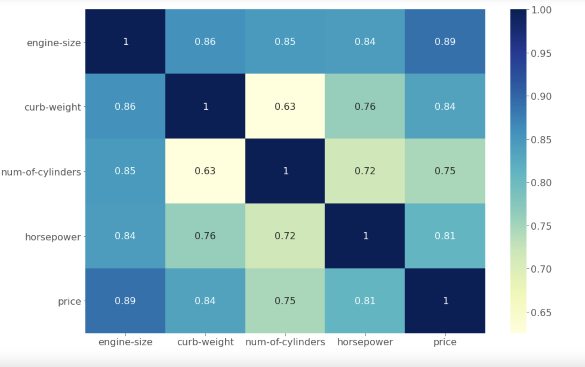
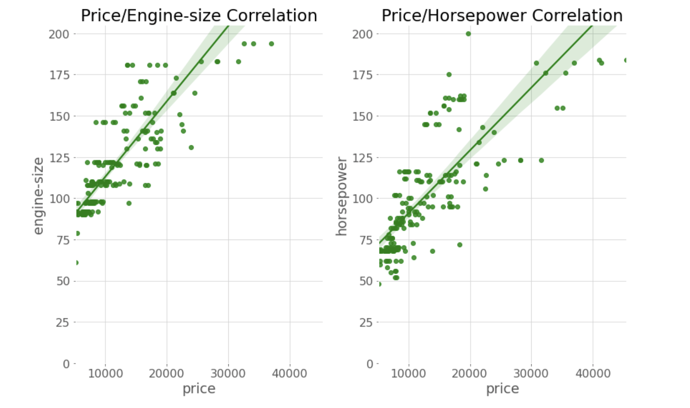
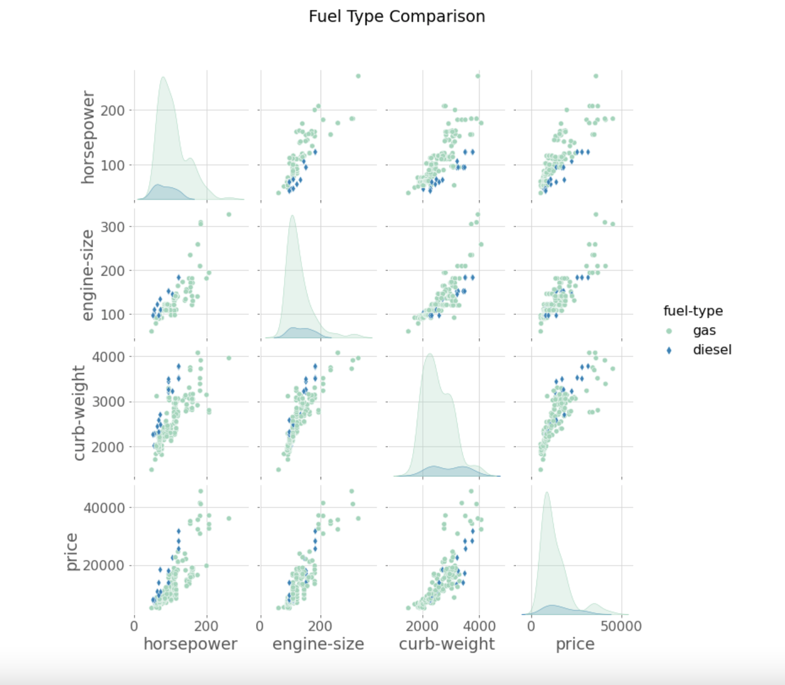
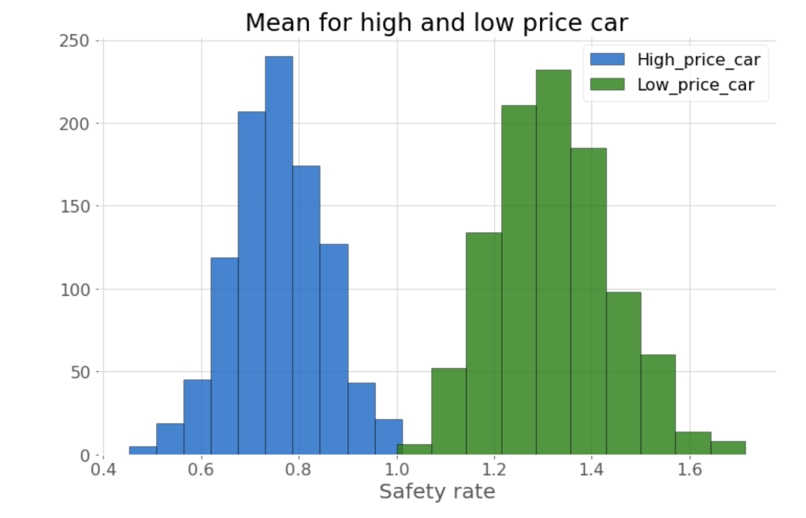

# Automobile Price estimation

----
## Marwah Faraj 

[Linkedin](https://www.linkedin.com/in/marwah-faraj-4272b4203/) | [Github](https://github.com/marwahfaraj) | [E-mail](marwah.faraj777@gmail.com)
----
## Content 

1-Background and Morivation 
2-Data: 
   Description 
    Pipline 
3-Exploration 
4-visualization 
5-Fuether Study 

## Background and Motivation  
This dataset consist of data From 1985 Ward's Automotive Yearbook, and it is contain information about used car. I’m interesting in showing what are the factors that affect the price estimation process. 

----

## Data
This dataset consist of data From 1985 Ward's Automotive Yearbook. 
This data set consists of three types of entities: (a) the specification of an auto in terms of various characteristics, (b) its assigned insurance risk rating, (c) its normalized losses in use as compared to other cars. The second rating corresponds to the degree to which the auto is more risky than its price indicates. Cars are initially assigned a risk factor symbol associated with its price. Then, if it is more risky (or less), this symbol is adjusted by moving it up (or down) the scale. Actuarians call this process "symboling". A value of +3 indicates that the auto is risky, -3 that it is probably pretty safe.

The third factor is the relative average loss payment per insured vehicle year. This value is normalized for all autos within a particular size classification (two-door small, station wagons, sports/speciality, etc…), and represents the average loss per car per year. 

## Pipline
The uncompressed csv containing the data is 41.8+ KB and contains 5530 records. The pandas, numpy, scipy, matplotlib, and seaborn software libraries was used to examine, plot and analyze this subset of data. 

----
## Exploration
Noticed this dataset do not contian null values as shown in the dataset info, but noticed that thers is some colomns are not givin any statistics. After further exploration notice that there is '?' symbole in the dataset, and there is data type is not as expected, and there is numerical value were presented in alphabatical order.

# visualization
## Price Estimation
The price of a car depends on three major factors.
First, the brand (make).
Second, the performance (engine size, horsepower, number of cylinder).
Third, the car features(curb weight, drive wheel, fuel type).

Starting with looking at the car prices distribution in the dataset

Looking how many cars that each manufacturer has in this dataset and found that Toyota is the brand that has the majority numbers of car.

Noticed that I have a lot of japanese car in the dataset,and this is due customers prefer smaller and more fuel efficient cars made by the japanese car makers.

## The make factor
The data positively skewed as shown in the previous plots, therefore I used  the median to show the price.
- The most expensive car is manufactured by Jaguar and the least expensive is Chevrolet.
- Rest of the cars are in the midrange between 10000 and 20000 which has the highest number of cars

## The preformance fator

I looked the dataset info correlation as show bellow:

And zooming in to visulize the correlation between the egine size, curb weight, number of cylinders, and horsepower

This the best fit line along with showing the 95% confidence interval, that the price is directly correlated with the engine size.
This the best fit line along with showing the 95% confidence interval, the price is directly correlated with the horsepower in 95% confidence interval.

## The featur factor
In this dataset, there are 3 different drive wheel types which they are Front wheel drive(fwd), Rear wheel drive (rwd), and Four wheels drive(4wd). It's very evident that the Rear wheel drive cars are most expensive and front wheel is least expensive cars. There is very less number of four wheel drive cars in our dataset so this picture might not be very accurate

### There is two fuel type, Gas and Diesel for the car in this dataset
- The price increases when the horsepower increase when the fuel type is either gas or diesel.
- The price increases when the engine size increase when the fuel type it either gas or diesel.
- The price increases more along with the curb weight increase when the fuel type is diesel.

# Q: Are the expensive cars are more safe?
Hypothesis testing
H0=mu for the safety rate of the expensive car = mu of the safety rate of cheap car
Ha=mu for the symboling of the expensive car not = mu of the symboling of cheap car
With using the Mann-Whitney U Test, and the range of the low price for the car in 1985 which was $ 6,298, the result was:

p value=0.037

And the null value is been rejected, and Yes the expensive car is more safe.

## Conclusions
The price estimation for these used car are affected by the brand, engine size, horsepower, curb weight, drive wheel and fuel type. 

## Further Study

