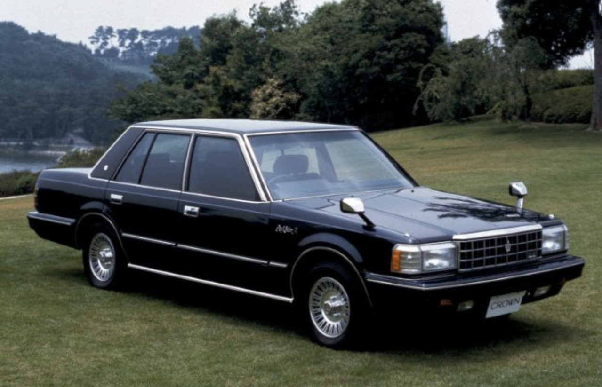
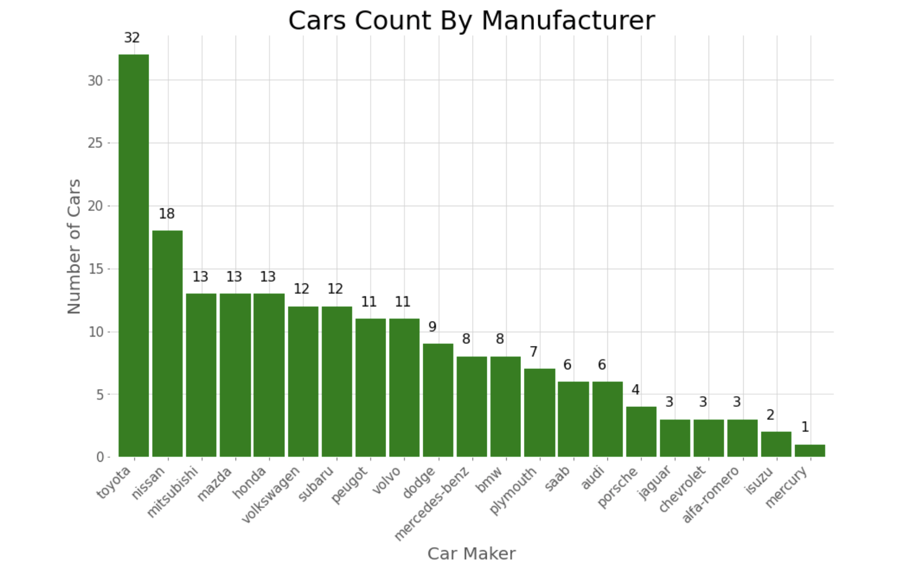
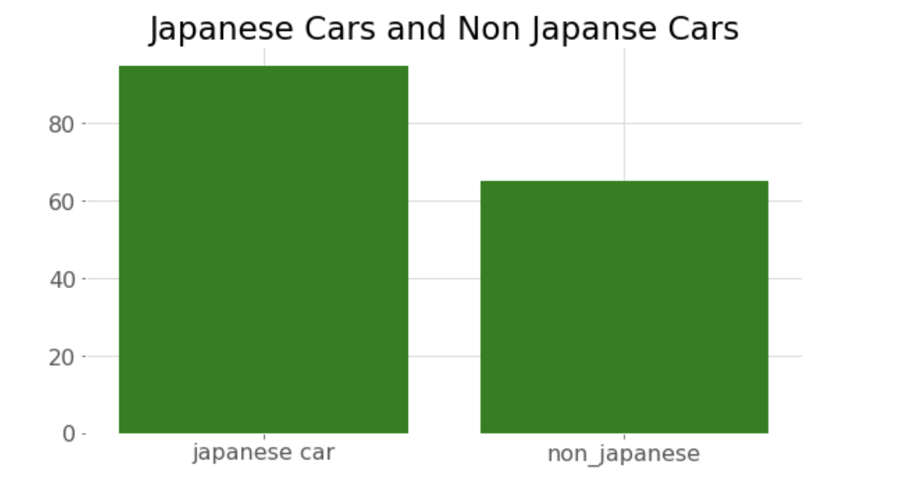
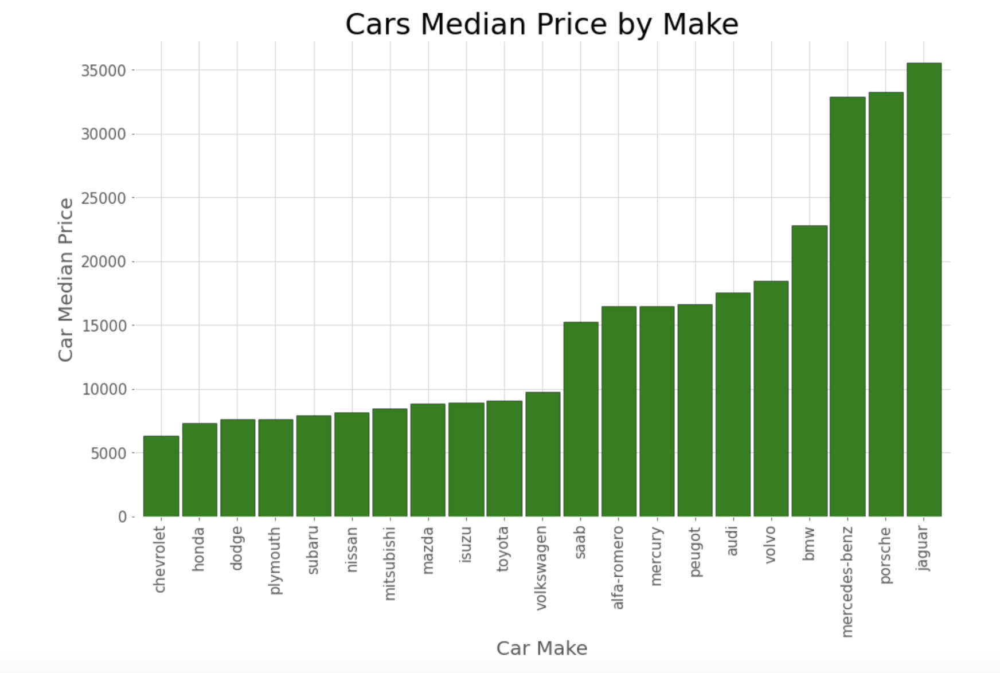
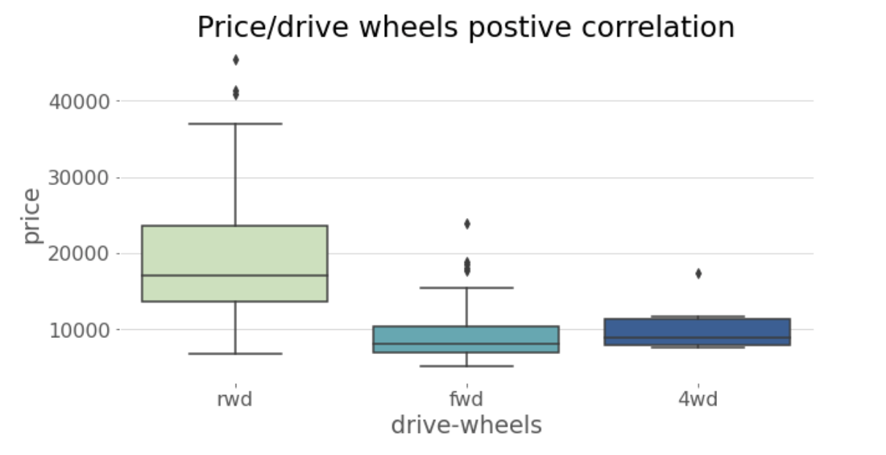
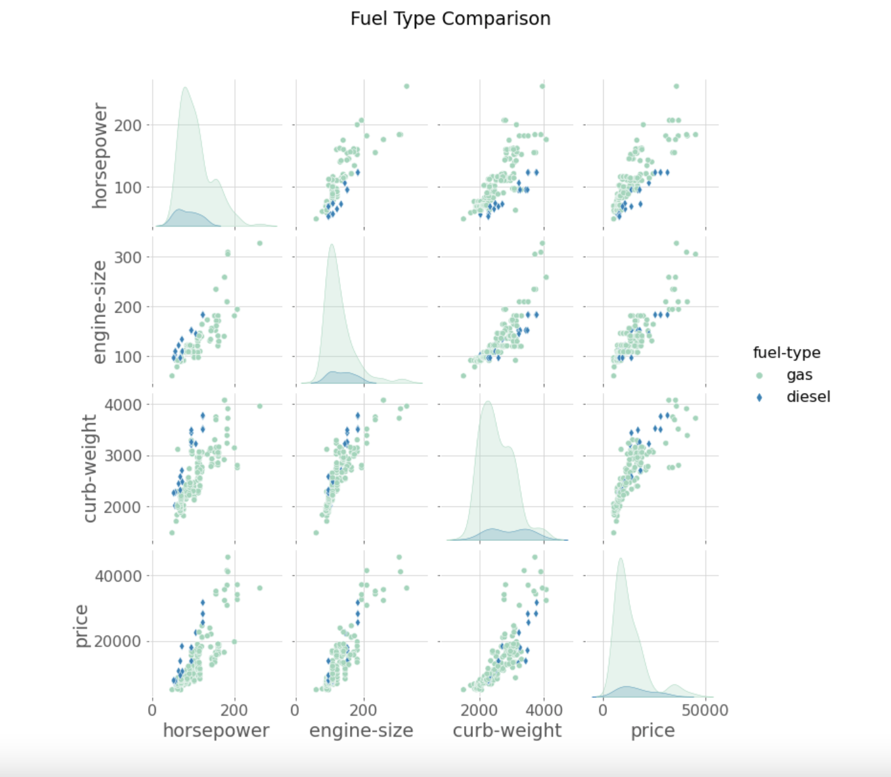
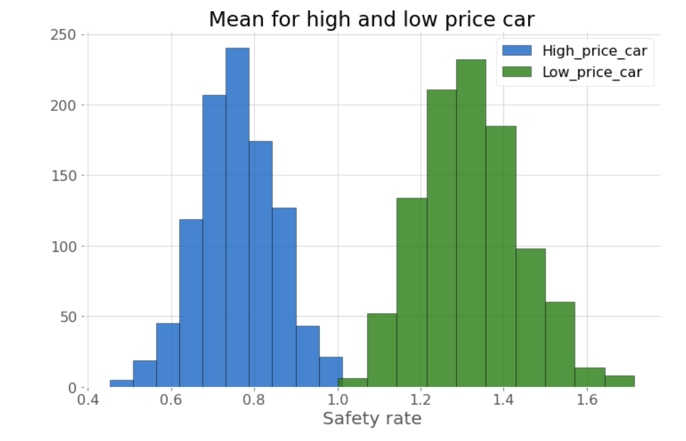
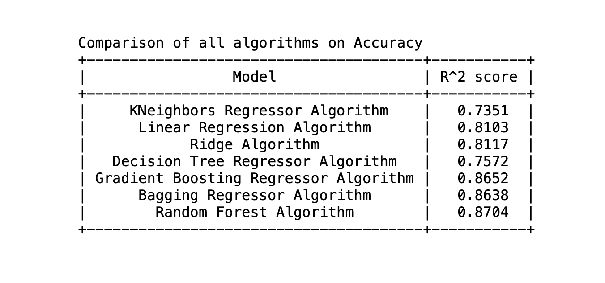

# Automobile Price Prediction

---

## Marwah Faraj

[LinkedIn](https://www.linkedin.com/in/marwah-faraj-4272b4203/) | [GitHub](https://github.com/marwahfaraj) | Email: marwah.faraj777@gmail.com

[Automobile Dataset](https://www.kaggle.com/toramky/automobile-dataset) | [Project Presentation](https://docs.google.com/presentation/d/1G8wWIvu87-hp_G9o6djAa4zj3Dws-9EIiR377FOOcCs/edit?usp=sharing)

---

# Table of Contents
1. [Background and Motivation](#background-and-motivation)
2. [Data](#data)  
    - [Description](#description)
    - [Pipeline](#pipeline)  
   
5. [Exploration](#exploration)
6. [Visualization](#visualization)
7. [Machine Learning](#machine-learning)
8. [Conclusions](#conclusions)
9. [Further Study](#further-study)

## Background and Motivation

This dataset contains information from the 1985 Ward's Automotive Yearbook, focusing on used cars. The aim is to analyze factors affecting the price estimation process.

---

## Data

This dataset includes information from 1985 Ward's Automotive Yearbook. It comprises three entities: 
1. Specifications of autos in terms of various characteristics.
2. Assigned insurance risk rating.
3. Normalized losses in use compared to other cars.

## Pipeline

The uncompressed CSV data is 41.8+ KB with 5530 records. Analysis is performed using pandas, numpy, scipy, matplotlib, and seaborn libraries.

---

## Exploration

The dataset doesn't contain null values, but some columns lack statistics. Further exploration revealed '?' symbols, unexpected data types, and numerical values presented alphabetically.

## Visualization

### Price Estimation

Factors affecting car price include brand, performance, and features. 

- Distribution of car prices:
  

- Car count by manufacturer:
  

- Distribution of Japanese cars:
  

### The Make Factor

- Median prices by manufacturer:
  

### The Performance Factor

- Correlation between engine size, curb weight, cylinders, and horsepower:
  

- Price correlation with horsepower and engine size:
  

### The Feature Factor

- Price correlation with drive wheel type:
  

- Price correlation with fuel type:
  

# Q: Are expensive cars safer?

Hypothesis testing:
- Null Hypothesis (H0): The safety rate of expensive cars equals that of cheap cars.
- Alternative Hypothesis (Ha): The safety rate of expensive cars differs from that of cheap cars.

Using the Mann-Whitney U Test, with a low car price range of $6,298, the result was:
- p-value = 0.037

The null hypothesis is rejected, indicating that expensive cars are safer.

## Machine Learning

Random Forest Algorithm yielded the best R^2 score among various machine learning algorithms.

## Conclusions

- Expensive cars tend to be safer.
- Price is strongly related to brand, performance, and specifications.
  - Brand: Jaguar is the most expensive.
  - Performance: Increasing engine size and horsepower correlates with higher prices.
  - Specifications: Rear-wheel drive cars are more expensive, and curb weight influences price, especially with diesel fuel types.
- Random Forest Algorithm achieved the highest accuracy with an R^2 score of 0.87.

## Further Study

- Apply deep learning algorithms for price prediction.
- Explore price differences between Japanese and non-Japanese cars.